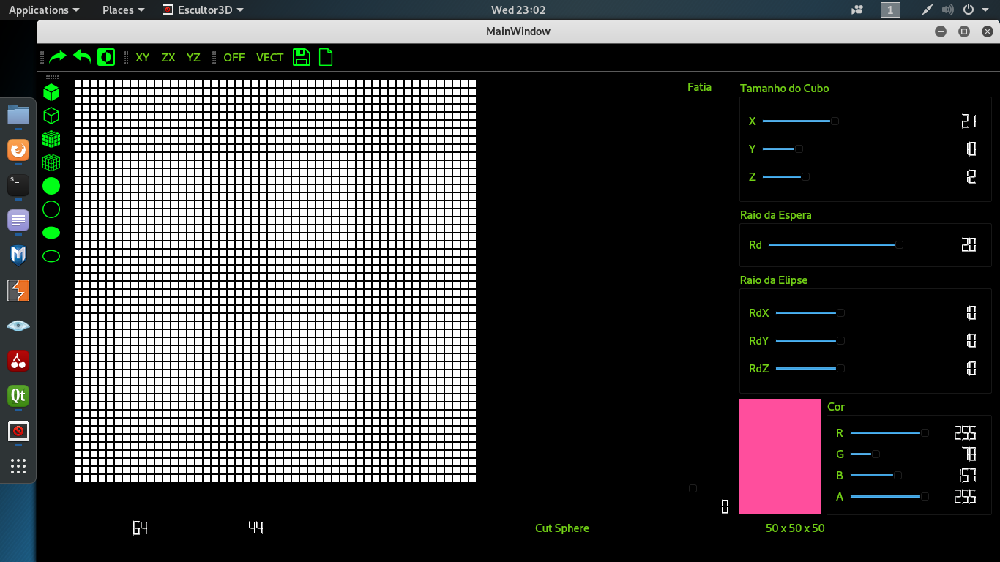

# Escultor 3D

## Documentation

by **[balbboa.github.io](https://balbboa.github.io)**

## The Sculptor

A sculptor that draws geometric figures in individual voxels (3d Pixels) and imports the figure to a .off or .vect format (Almost a Paint 3D). The image above shows the main window of the software:
   
  

  
  

   
  The Sculptor have 8 main funcionalities:
  
 <ul>
   <li><b>Put Voxel</b>: Paint a small cube(1x1) in the environment.</li> 
   <li><b>Put Box</b>: Paint a box (you choose the size) in the environment.</li> 
   <li><b>Put Sphere</b>: Paint a sphere (you choose the size) in the environment.</li>
   <li><b>Put Ellipsoid</b>: Paint an ellipsoid (you choose the size) in the environment.</li> 
   <li><b>Cut Voxel</b>: Erases a small cube(1x1) in the environment.</li> 
   <li><b>Cut Box</b>: Erases a box (you choose the size) in the environment.</li> 
   <li><b>Cut Sphere</b>: Erases a sphere (you choose the size) in the environment.</li>
   <li><b>Cut Ellipsoid</b>: Erases an ellipsoid (you choose the size) in the environment.</li>
 </ul>

### How to use

To contribute, please ensure that you have stable [Qt Creator](https://www.qt.io/) installed.

If `Qt` is installed, follow the steps below.

1. Fork and clone the repo.
2. Open the project in `Qt`.
3. Run the `main.cpp`.

ps.: Go to `plotter.cpp` file to change the output directory of the VECT and OFF files.
